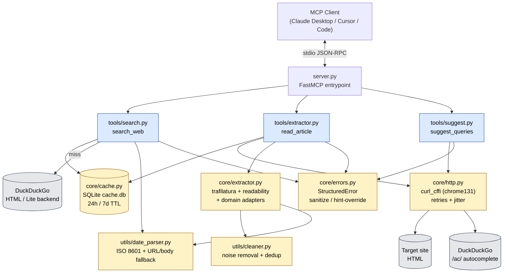
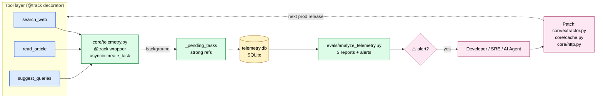
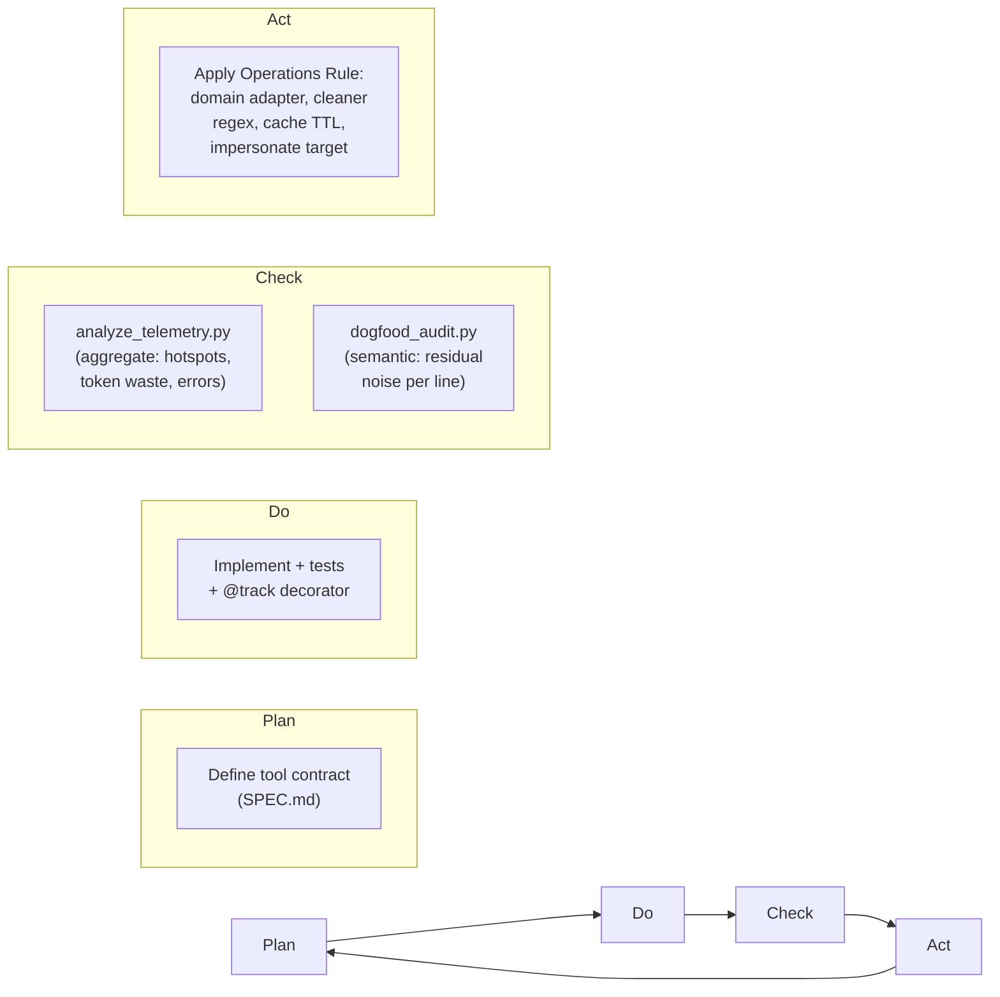

# Architecture — DeepSearch-MCP

System map for the server: how a single MCP request flows from a client
through the tool layer, the core services, and the telemetry layer.

For the conceptual rationale ("why this design"), see [CONCEPT.md](CONCEPT.md).
For the operational playbook ("what to do when X happens"), see [MAINTENANCE.md](MAINTENANCE.md).

---

## 1. High-level data flow



### Key invariants

- **Single entrypoint.** Everything goes through `server.py`. Adding a tool
  means adding a `from .tools import X` line there.
- **Tools never raise.** Every tool returns a `str`. Failures return a
  JSON-encoded `StructuredError`, not a Python traceback.
- **No shared mutable state across coroutines.** `DDGS()` and `aiosqlite`
  connections are created per call. `curl_cffi` `AsyncSession` is also
  scoped to a single fetch.

---

## 2. The telemetry layer (Phase 6)

Every tool call is wrapped by `@track(tool_name, primary_input)`. The
decorator is **fire-and-forget**: it returns the tool's result first, then
schedules the write as an `asyncio.create_task`. A telemetry outage cannot
break a live agent loop.



### Schema

```sql
CREATE TABLE telemetry (
    id            INTEGER PRIMARY KEY AUTOINCREMENT,
    timestamp     TEXT    NOT NULL,    -- ISO 8601 (UTC)
    tool_name     TEXT    NOT NULL,    -- search_web / read_article / suggest_queries
    input_summary TEXT    NOT NULL,    -- ≤ 80 chars, sha1[:8] suffix when truncated
    status        TEXT    NOT NULL,    -- "success" | error code
    tokens_approx INTEGER NOT NULL,    -- len(output) // 4
    latency_ms    INTEGER NOT NULL,
    domain        TEXT                 -- hostname (read_article only)
);
CREATE INDEX idx_tool_time ON telemetry(tool_name, timestamp);
CREATE INDEX idx_status    ON telemetry(status);
CREATE INDEX idx_domain    ON telemetry(domain);
```

### Privacy & cost guarantees

- `input_summary` is truncated to ≤ 80 chars; longer inputs get a stable
  `sha1[:8]` digest appended so duplicates still group, but the full
  query/URL never lands on disk.
- DB writes are deduplicated to the per-call path — no batching daemon,
  no extra threads, no background polling.
- Set `DEEPSEARCH_TELEMETRY=0` to disable the table entirely (zero-impact
  passthrough). The pytest suite sets this by default in `tests/conftest.py`.

---

## 3. The PDCA self-healing loop

Telemetry is not for dashboards — it is for the **next patch**. The CHECK step
has **two complementary probes**:

- **Aggregate / frequency** — `evals/analyze_telemetry.py` reads `telemetry.db`
  and surfaces failure hotspots, token inefficiency, and error patterns. Maps
  to `METHODOLOGY.md` Operations Rules. Activate it on a new deployment with
  `scripts/collect_telemetry.py` (drives the real tools to seed the DB). Below
  `MIN_ROWS_FOR_CONFIDENCE` rows the analyzer marks its verdicts PROVISIONAL —
  thin data is explicitly *not* treated as health.
- **Semantic / per-line** — `evals/dogfood_audit.py` scans live extraction
  *bodies* (which telemetry deliberately does not store) for residual noise the
  cleaner missed. Maps to `METHODOLOGY.md` §3 Rule 1/2.

They cover each other's blind spots: telemetry sees *how often* but never *what
text*; the auditor sees *what text* but only on the dogfood corpus.

A third, **inter-release** view sits on top: `evals/telemetry_diff.py --before A
--after B` diffs two `telemetry.db` snapshots (success rate, tokens/call,
latency, error-code churn) so a release can be judged better-or-worse, not just
described in isolation. It carries the same PROVISIONAL guard as the aggregate
probe. Operations Rule 6 (extraction-length drift) is built on this diff.

Above all of these, `evals/benchmark.py` computes the **DeepSearch Quality Score
(DQS, 0–100)** — a fixed, offline, deterministic composite (extraction /
cleanliness / robustness / diversity) that rolls the validated quality measures
into one release-trackable number. It is a *proxy over fixtures* (a regression
north-star), explicitly not a replacement for the live probes above.



The loop is **deliberately slow** — patches land per release, not per request.
This avoids "self-modifying production code" risk while still giving the
project a measurable improvement trajectory.

### Two dogfood checks, different questions

| Tool | Question it answers | Fails when |
|------|---------------------|-----------|
| `dogfood_regression.py` | "Did extraction **drift** from known-good output?" | a change silently alters a golden baseline |
| `dogfood_audit.py` | "Is there **new noise** we haven't patched yet?" | a body contains a suspected-noise line post-cleaner |

---

## 4. Extension points

| Want to add… | Touch… | See pattern… |
|--------------|--------|--------------|
| A new MCP tool | `tools/<name>.py` + import in `server.py` | `tools/suggest.py` |
| A new error code | `core/errors.py` `_HINTS` + constant | `UNSUPPORTED_FORMAT` (Phase 4) |
| A domain-specific cleaner | `core/extractor.py` `_DOMAIN_PREPROCESSORS` | `_substack_preprocess` (Phase 6) |
| A new quality axis | `evals/eval_judge.py` `score_markdown` | Density floor for code-heavy pages |
| A new telemetry report | `evals/analyze_telemetry.py` new function + CLI hook | `failure_hotspots()` |
| A new noise-suspicion heuristic | `evals/dogfood_audit.py` `_STRONG_HEURISTICS` / `_SOFT_HEURISTICS` | `AFFILIATE_SPONSOR` (strong), `PROMO_CTA` (soft) |
| A new dogfood fixture | `evals/dogfood_research.py` fixture + `URLS`, then `dogfood_regression.py --update` | `ZDNET_HTML` |
| A trusted (authoritative) source domain | `core/source_quality.py` `_AUTH_DOMAINS` / `_AUTH_TLDS` | `reuters.com`, `ai.meta.com`, `.gov` |
| A search-backend fallback | `tools/search.py` `_ddg_html_fallback` | direct `html.duckduckgo.com` scrape (B12) |

---

## 5. What is **not** in this server (by design)

- **No LLM API calls.** The server is local + standalone. `suggest_queries`
  uses templates and DDG autocomplete, not a remote model.
- **No proxy rotation.** `curl_cffi` impersonation + jitter is the only
  stealth layer. If you need rotating proxies, wrap the server, don't
  modify it.
- **No write tools.** All three tools are read-only. The server never
  posts, scrapes credentials, or sends mail.
- **No long-running tasks.** Every tool call returns within ≤ 30 s
  (10 s HTTP timeout × 3 retries). There is no background queue.
